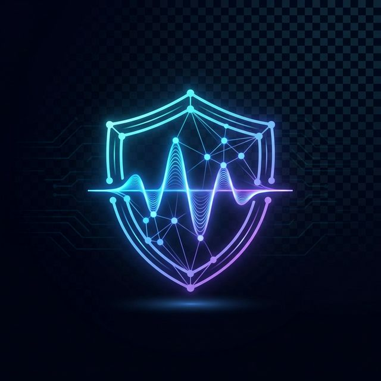

<div align="center">



# 🎙️ DeepGuard AI
### **Next-Generation Deepfake Audio Detection**

**Empowering digital trust through hybrid deep learning architectures.**

[](https://github.com/)
[](https://python.org)
[](https://pytorch.org)
[](https://reactjs.org)
[](LICENSE)

---

**[Quick Start](#-quick-start)** • **[Features](#-features)** • **[Architecture](#-model-architecture)** • **[Performance](#-model-performance)** • **[API](#-api-reference)**

</div>

---

## 📌 Overview

**DeepGuard AI** is a professional-grade full-stack solution for identifying **AI-generated (spoofed) audio**. By leveraging a **Hybrid CNN + GRU Fusion Model**, the system analyzes both spectral frequency distributions and temporal sequence patterns to detect even the most sophisticated deepfakes.

> **Our mission:** To provide a robust, fast, and accurate tool for verifying audio authenticity in the age of AI.

---

## 🚀 Quick Start (Windows)

The project includes an automated startup script that handles environment setup, dependency installation, and server launching.

1.  **Clone the repository.**
2.  **Run the startup script:**
    ```bash
    run_project.bat
    ```
    *This will automatically create a Python virtual environment, install backend/frontend dependencies, and launch both servers.*

---

## ✨ Key Features

- 💎 **Hybrid Detection Pipeline** — Combines Convolutional Neural Networks (CNN) for spectral analysis and Gated Recurrent Units (GRU) for temporal analysis.
- ⚡ **Real-time Processing** — Get results in seconds for both audio and video uploads.
- 🛠️ **Video Audio Extraction** — Automatically strips and analyzes audio tracks from video formats (`.mp4`, `.mov`, etc.).
- 📊 **Dynamic Analytics** — Live performance metrics including ROC curves, confusion matrices, and loss history.
- 🔐 **Enterprise-Ready Auth** — Secure JWT-based user authentication and prediction history tracking.
- 🎨 **Modern UX** — A high-performance React dashboard with a sleek, dark-themed glassmorphic interface.

---

## 🧠 Model Architecture

DeepGuard AI uses a dual-branch fusion architecture to ensure maximum detection recall.

- **Branch A (SpectralCNN):** Processes 128×128 Mel-spectrograms to detect frequency-domain anomalies and synthetic artifacts.
- **Branch B (TemporalGRU):** Processes raw audio windowed frames to identify unnatural temporal sequences common in AI synthesis.
- **Fusion Layer:** Combines both high-dimensional features into a unified classifier for the final verdict.

---

## 📊 Model Performance

Evaluated on the **ASVspoof 2019 Logical Access (LA)** dataset.

| Metric | Score |
| :--- | :--- |
| **Accuracy** | **91.52%** |
| **Precision** | **99.87%** |
| **Recall** | **88.76%** |
| **F1 Score** | **93.99%** |

---

## 🛠️ Installation & Manual Setup

If you prefer to set up the environment manually:

### Backend
1. `cd backend`
2. `python -m venv .venv`
3. `source .venv/bin/activate` (or `.venv\Scripts\activate` on Windows)
4. `pip install -r requirements.txt`
5. `python app.py`

### Frontend
1. `cd frontend`
2. `npm install`
3. `npm run dev`

---

## 🔌 API Reference

| Method | Endpoint | Description |
| :--- | :--- | :--- |
| `POST` | `/api/auth/register` | User registration |
| `POST` | `/api/auth/login` | JWT Authentication |
| `POST` | `/api/predict` | Deepfake detection (requires auth) |
| `GET` | `/api/history` | User prediction history |
| `GET` | `/api/metrics` | Public model metrics |

---

## 🤝 Contributing

We welcome contributions! Please fork the repository and submit a pull request for any enhancements.

---

<div align="center">
  <p>Final Year Project • Built with ❤️ for Digital Security</p>
  
</div>